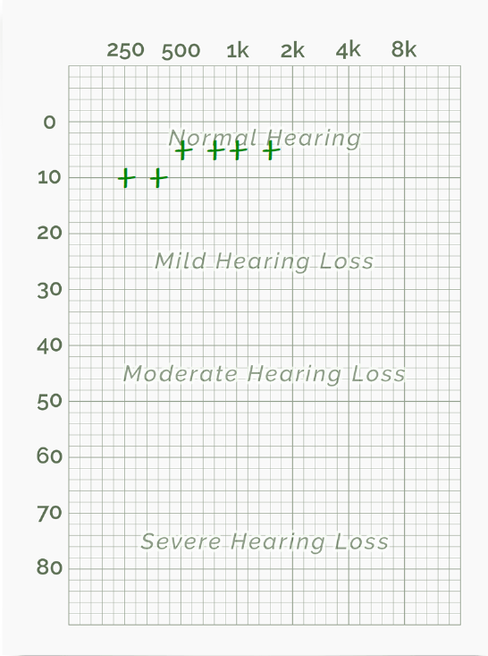

## CTF Laboratorium nr 1  
### 07.11.2021

```
    Mikołaj Czajka    
    wykorzystane słuchawki: LG TONE Free FN4
```
***
### `Zadanie 1. Percepcja słuchowa`
***
- [x] Test 1 - **Phonak**


Wynik testu *Good hearing*, test bardzo szybki bazuj±cy na subiektywnych pytaniach. 
W te¶cie słyszalno¶ci również mało  opcji sprawdzaj±cych. Test w moim odczuciu niedokładny.


---

- [x] Test 2 - **Blamey Saunders hears**  
Test sprawdzaj±cy słuch na podstawie angielskich wyrazów - 
  nie sprawdza słuchu dla poszczególnych częstotliwo¶ci
  lecz na podstawie 50 pomiarów potrafi okre¶lić z jakimi czę¶ciami
  mowy radzimy sobie gorzej.
  Dla testu wykonanego przeze mnie najgorszy wynik wypadł dla wysoko¶ci samogłosek - 
  pionowe ustawienie języka wpływaj±ce na brzmienie liter "i" oraz "u" (dla języka angielskiego).
  Test przydatny dla osób ucz±cych się j. angielskiego. 


---

- [x] Test 3 - **hearingtest.online**  

| Test oryginalny      |  Zwiększon± rozdzielczo¶ci± dla niskich częstotliwo¶ci     | zwiększona rozdzielczo¶ci± dla wysokich częstotliwo¶ci | 
| ------ | --------- | ---------------- |
|  |   |          | 


Raporty z testów w formacie *pdf* znajduj± się w plikach /files.
Test sprawdzał próg, dla którego zaczynamy słyszeć poszczególne częstotliwo¶ć sygnału.
Progów gło¶no¶ci w te¶cie było 12 - od ledwo słyszalnych do bardzo gło¶nych. 
Test wyróżniał pomiary dla lewego, prawego oraz dwóch uszu na raz. 
Test wydaję się być miarodajny. Przeprowadzany był w cichym otoczeniu w słuchawkach dokanałowych. 

W przypadku moich testów, niskie częstotliwo¶ci były słabiej słyszalne niż ¶rednie, wysokie za to najlepiej. 
Zwiększenie rozdzielno¶ci dla poszczególnych częstotliwo¶ci pozwala lepiej zobaczyć przy jakich częstotliwo¶ciach 
zaczynamy mieć lepsze/gorsze wyniki. 

---


***
### `Zadanie 2. Pomiary podstawowych parametrów dĽwięku`
***
- [x] Test 1
Test wykonano przy pomocy gło¶nika bluetooth JBL posiadaj±cego pojedynczy gło¶nik 3W.
  Wykonano trzy testy:
1. Jedna powierzchnia odbijaj±ca - gło¶nik ok. 30cm od ¶ciany    
2. Dwie powierzchnie odbijaj±ce - gło¶nik w narożniku 
3. Trzy powierzchnie odbijaj±ce - gło¶nik w narożniku na podłodze 

Spostrzeżenia:
DĽwięk (1) przy odtwarzaniu utworu muzycznego przy ¶cianie brzmiał podobnie, do normalnego odsłuchu, gdy gło¶nik stoi
na przykład na półce, ustawiaj±c gło¶nik w narożniku (2) utwór wydaje się gło¶niejszy, ma więcej basu, lecz jest subiektywnie
gorszej jako¶ci. Efekt nasila się jeszcze bardziej gdy gło¶nik postawimy na podłodze, niskie tony wydaj± się jeszcze gło¶niejsze.
Utwór brzmi gorzej, czę¶ć fal odbija się od ¶ciany - powstaj± fale stoj±ce, dla niektórych częstotliwo¶ci fale
wygaszaj± się, dla nie których wzmacniaj± powoduj±c powstanie  pików i dziur dla różnych tonów. 

--- 
- [x] Test 2

Pomiar 1 - pewna odległo¶ć od ¶ciany
Pomiar 2 - urz±dzenie mobilne na podłodze w rogu między dwoma ¶cianami 

##### ¦rednie warto¶ci mocy sygnału w każdym pa¶mie
Pomiar 1 - pewna odległo¶ć od ¶ciany    
Pomiar 2 - urz±dzenie mobilne na podłodze w rogu między dwoma ¶cianami 


---

##### Poziom gło¶no¶ci
Pomiar 1 - pewna odległo¶ć od ¶ciany    
Pomiar 2 - urz±dzenie mobilne na podłodze w rogu między dwoma ¶cianami 


- Dla telefonu umieszczonego w rogu mieszkania można zauważyć 
¶redni poziom gło¶no¶ci wyższy o około 8dB.
  
- Moc sygnału dla telefonu umieszczonego w narożniku była 
większa dla podpasm oktawowych od 125Hz w górę z pominięciem
  6300Hz oraz 8000Hz, dla których oba pomiary maj± taki sam wynik. 
  


---
- [x] Test 3

Parametry butelki

	- objęto¶ć V = 550 cm^3 
	- pole powierzchni  otworu w szyjce butelki A = 2.6 cm^2
	- długo¶ć szyjki L = 7 cm	
	    -> częstotliwo¶ć Helmholtza = 142.69 Hz	
	
	
| V      | woda      | f oblicz. \[Hz\] | f zmierzone \[Hz\] |
| ------ | --------- | ---------------- | ------------------ |
| 550 ml | \+ 0 ml   | 142.69           | 166                |
| 450 ml | \+ 100 ml | 157.75           | 188                |
| 350 ml | \+ 200 ml | 178.87           | 201                |
| 250 ml | \+ 300 ml | 211.64           | 260                |
| 150 ml | \+ 400 ml | 273.23           | 378                |

 - Różnica wyników może wynikać z kształtu butelki, która została wybrana do testów, 
szyjka w butelce stopniowo rozszerzała się do szeroko¶ci całej butelki dlatego zmierzenie
   długo¶ci L było obarczone błędem. 
   - Zmniejszenie  objęto¶ci przez dolanie wody zwiększa częstotliwo¶ć co pokrywa się z wzorem na częstotliwo¶ć rezonansow±,
    gdzie objęto¶ć jest odwrotnie proporcjonalna do częstotliwo¶ci. 
   
