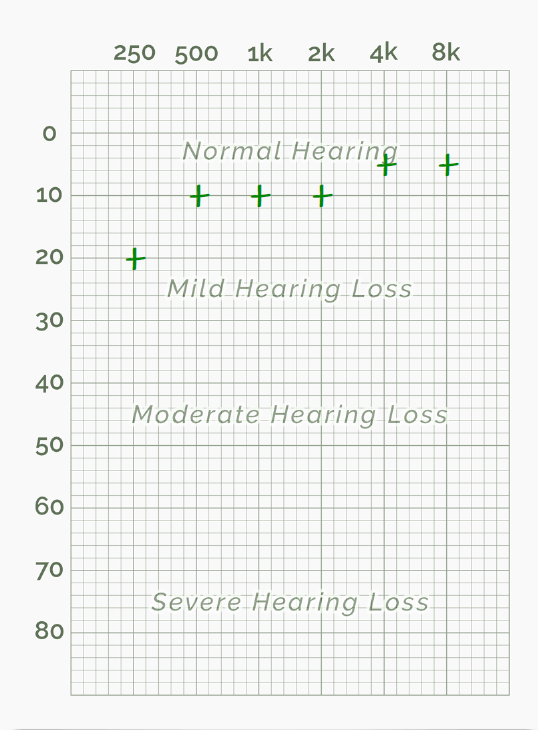
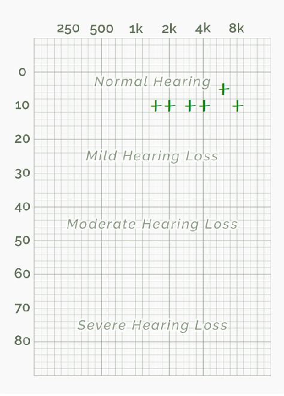
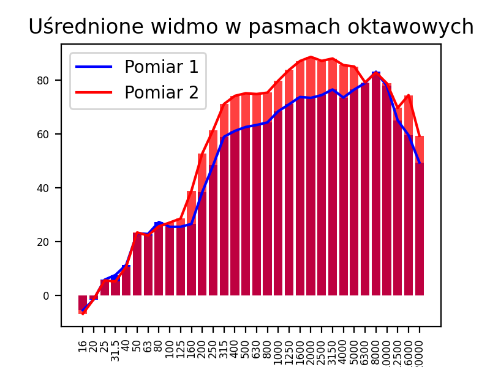
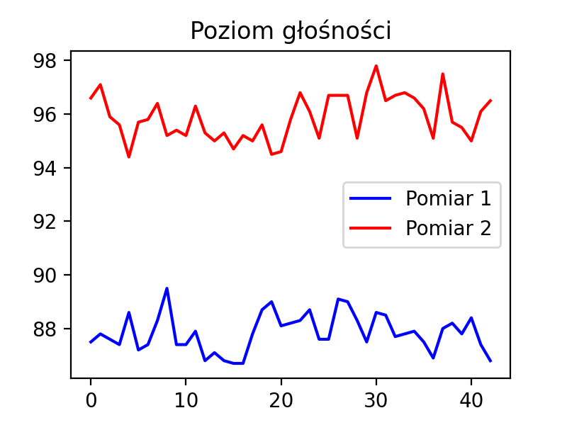

```
    CTF Laboratorium nr 1/2  
    Mikołaj Cz 
    wykorzystane słuchawki: LG TONE Free FN4
```
***
### `Zadanie 1. Percepcja słuchowa`
***
- [x] Test 1 - **Phonak**


Wynik testu *Good hearing*, test bardzo szybki bazujący na subiektywnych pytaniach. 
W teście słyszalności również mało  opcji sprawdzających. Test w moim odczuciu niedokładny.


---

- [x] Test 2 - **Blamey Saunders hears**  
Test sprawdzający słuch na podstawie angielskich wyrazów - 
  nie sprawdza słuchu dla poszczególnych częstotliwości
  lecz na podstawie 50 pomiarów potrafi określić z jakimi częściami
  mowy radzimy sobie gorzej.
  Dla testu wykonanego przeze mnie najgorszy wynik wypadł dla wysokości samogłosek - 
  pionowe ustawienie języka wpływające na brzmienie liter "i" oraz "u" (dla języka angielskiego).
  Test przydatny dla osób uczących się j. angielskiego. 


---

- [x] Test 3 - **hearingtest.online**  

| Test oryginalny      |  Zwiększoną rozdzielczością dla niskich częstotliwości     | zwiększona rozdzielczością dla wysokich częstotliwości | 
| ------ | --------- | ---------------- |
|  |   |          | 


Raporty z testów w formacie *pdf* znajdują się w plikach /files.
Test sprawdzał próg, dla którego zaczynamy słyszeć poszczególne częstotliwość sygnału.
Progów głośności w teście było 12 - od ledwo słyszalnych do bardzo głośnych. 
Test wyróżniał pomiary dla lewego, prawego oraz dwóch uszu na raz. 
Test wydaję się być miarodajny. Przeprowadzany był w cichym otoczeniu w słuchawkach dokanałowych. 

W przypadku moich testów, niskie częstotliwości były słabiej słyszalne niż średnie, wysokie za to najlepiej. 
Zwiększenie rozdzielności dla poszczególnych częstotliwości pozwala lepiej zobaczyć przy jakich częstotliwościach 
zaczynamy mieć lepsze/gorsze wyniki. 

---


***
### `Zadanie 2. Pomiary podstawowych parametrów dźwięku`
***
- [x] Test 1
Test wykonano przy pomocy głośnika bluetooth JBL posiadającego pojedynczy głośnik 3W.
  Wykonano trzy testy:
1. Jedna powierzchnia odbijająca - głośnik ok. 30cm od ściany    
2. Dwie powierzchnie odbijające - głośnik w narożniku 
3. Trzy powierzchnie odbijające - głośnik w narożniku na podłodze 

Spostrzeżenia:
Dźwięk (1) przy odtwarzaniu utworu muzycznego przy ścianie brzmiał podobnie, do normalnego odsłuchu, gdy głośnik stoi
na przykład na półce, ustawiając głośnik w narożniku (2) utwór wydaje się głośniejszy, ma więcej basu, lecz jest subiektywnie
gorszej jakości. Efekt nasila się jeszcze bardziej gdy głośnik postawimy na podłodze, niskie tony wydają się jeszcze głośniejsze.
Utwór brzmi gorzej, część fal odbija się od ściany - powstają fale stojące, dla niektórych częstotliwości fale
wygaszają się, dla nie których wzmacniają powodując powstanie  pików i dziur dla różnych tonów. 

--- 
- [x] Test 2

Pomiar 1 - pewna odległość od ściany
Pomiar 2 - urządzenie mobilne na podłodze w rogu między dwoma ścianami 

##### Średnie wartości mocy sygnału w każdym paśmie
Pomiar 1 - pewna odległość od ściany    
Pomiar 2 - urządzenie mobilne na podłodze w rogu między dwoma ścianami 



---

##### Poziom głośności
Pomiar 1 - pewna odległość od ściany    
Pomiar 2 - urządzenie mobilne na podłodze w rogu między dwoma ścianami 




- Dla telefonu umieszczonego w rogu mieszkania można zauważyć 
średni poziom głośności wyższy o około 8dB.
  
- Moc sygnału dla telefonu umieszczonego w narożniku była 
większa dla podpasm oktawowych od 125Hz w górę z pominięciem
  6300Hz oraz 8000Hz, dla których oba pomiary mają taki sam wynik. 
  


---
- [x] Test 3

Parametry butelki

	- objętość V = 550 cm^3 
	- pole powierzchni  otworu w szyjce butelki A = 2.6 cm^2
	- długość szyjki L = 7 cm	
	    -> częstotliwość Helmholtza = 142.69 Hz	
	
	
| V      | woda      | f oblicz. \[Hz\] | f zmierzone \[Hz\] |
| ------ | --------- | ---------------- | ------------------ |
| 550 ml | \+ 0 ml   | 142.69           | 166                |
| 450 ml | \+ 100 ml | 157.75           | 188                |
| 350 ml | \+ 200 ml | 178.87           | 201                |
| 250 ml | \+ 300 ml | 211.64           | 260                |
| 150 ml | \+ 400 ml | 273.23           | 378                |

 - Różnica wyników może wynikać z kształtu butelki, która została wybrana do testów, 
szyjka w butelce stopniowo rozszerzała się do szerokości całej butelki dlatego zmierzenie
   długości L było obarczone błędem. 
   - Zmniejszenie  objętości przez dolanie wody zwiększa częstotliwość co pokrywa się z wzorem na częstotliwość rezonansową,
    gdzie objętość jest odwrotnie proporcjonalna do częstotliwości. 
   
