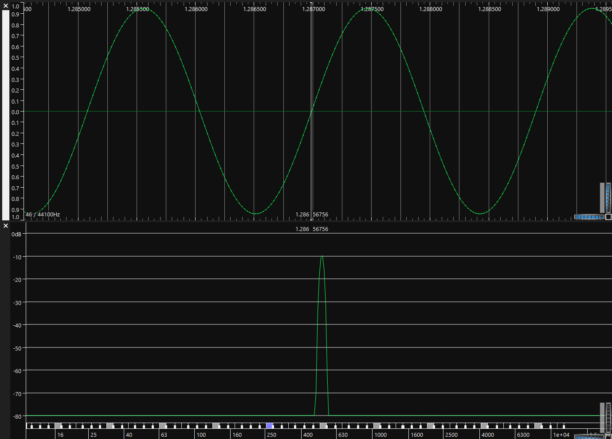
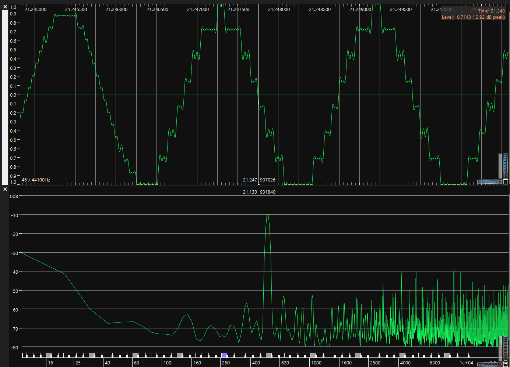
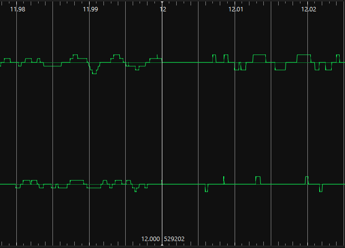
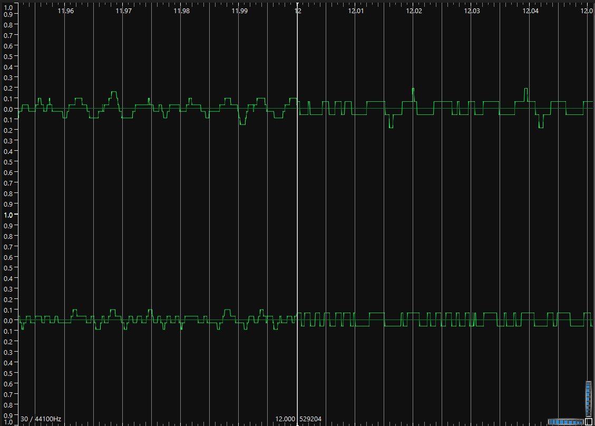
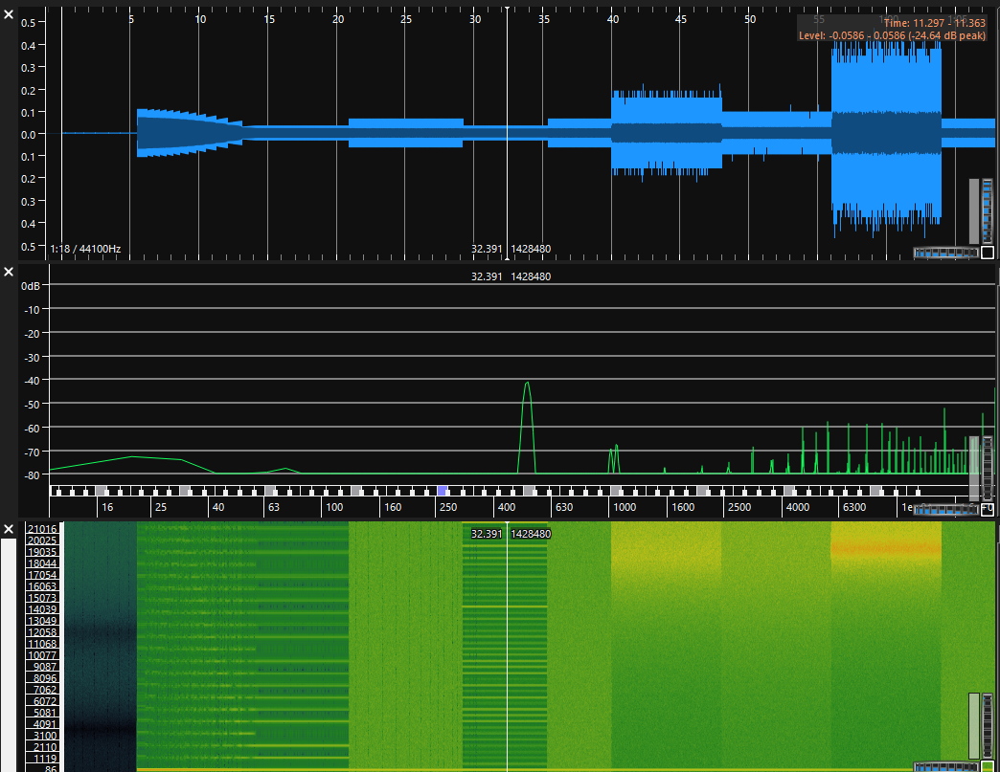

> CTF Laboratorium nr 3/4
> 
>    Mikołaj Cz.      
> 
> 2022

***
### `Zadanie 1. Próbkowanie`
Za pomocą programu  Sonic Visualiser wczytano plik  *Oscillator_2_4_8_16kHz_PitchUp_and_PitchDown_Fs44100Hz.wav* 
i ustawiono zalecane parametry. 
Plik dźwiękowy zawierał sume sygnałów sinusoidalnych o częstotliwościach początkowych 2kHz, 4kHz, 8kHz i 16kHz
o zmiennej liniowo wysokości dla wszystkich tonów w czasie.

Po odchłuchaniu pliku wraz z analizą zobrazowanego wida można zauważyć, że:
- Częstotliwość próbkowania sygnału wynosiła 44100Hz  (0.5 * 44100 = 22050), 
  pasmo sygnału przekraczało więc w pewnych momentach połowę szybkości próbkowania - powoduje to
  nachodzenie na siebie widma sygnału w poaśmienie podstawowym oraz lustrzanego odbicia widma.
  Zachodzi zjawisko aliasingu
  

Nastepnie wczytano pliki:  
*Original_piano.wav*  
*Original_piano_sampled_at8kHz_sample1.wav*  
*Original_piano_sampled_at8kHz_sample2.wav*  

Po odłuchaniu plików można zauważyć:
- W pliku sample1 wyraźnie słychać zniekształcenia spowodowane aliasingiem, sygnałm jest próbkowany 
  ze zbyt małą częstotliwością. Na spektometrze można zauważyć przesunięcę sygnału względem sygnału oryginalnego
- Sample2 jest również próbkowany w niskiej częstotliwości jednak po zastosowaniu filtra antyaliasingowego 
  jest on tylko nieznacznie gorszej jakości od oryginału, 
  wykres spektrem w większości pokrywa się z *Original_piano.wav*.
  

***
### `Zadanie 2. Kwantyzacja`
Za pomocą programu  Sonic Visualiser wczytano plik  *quantization_sinus_mono_loweringBitDepth.wav* 
i ustawiono zalecane parametry.   
*Plik dźwiękowy rozpoczyna się od sygnału skwantowanego do 16 bitów i co pewien czas rozdzielczość bitowa
jest zmniejszana o 1 bit, aż do docelowej. Następnie rozdzielczość jest ponownie zwiększana aż do 24 bitów.*

Obserwacje:  
Początek sygnału - kwantowanie 16 bitowe

  

Część sygnału gdy kwantyzacja spadła do wartości 3 bitów -. **t = 21s**
Poziom błędu kwantyzacji jest wtedy największy:

- w dziedzinie czasu widać, że sinus jest najgorzej odzorowany, wykres jest poszarpany.
W 3 bitach można maksymalnie zapisać osiem poziomów 0-7 (000-111), na przebiegu czasowym
  widać wyraźnie kolejne stopnie od zera do maksimum.
  
- W dziedzinie częstotliwości oprócz jednego piku dla sinusa pojawią coraz więcej szumu o różnych częstowliwoścach,
dla najniższego poziomu kwantyzacji szum jest największy. 
  
- Przy osłuchu pliku można zauważyć pojawiający się szum, na początku słyszymy tylko jednostajny 
dźwięk sygnału sinusoidalnego, po pewnym czasie dodatkowe dźwięki wysokiej częstotliwości, które szybko 
  narastają wraz ze mniejszaniem się ilości bitów. Dla najniższego poziomu zakłóceń ten jest najgłośniejszy. 

  

Następnie wczytano plik:
- *Piano_16b_to_2b_to_16b_quantizer1.wav*    
*Plik jest skonstruowany tak, że oryginalne nagranie partii fortepianu jest skwantowane do 16 bitów, 
następnie rozdzielczość kwantyzatora jest zmniejszana do 2 bitów i ponownie zwiększana do 16 bitów.*
    - Najsłabszy poziom skantowania = 2 bity (czyli 4 poziomy 0-3)
osiągany jest w **t = 12s**. Część sygnału jest wtedy niesłyszalna. 
  
    - Podobnie jak w poprzednim przypadku, im mniej poziomów kwantyzacji tym wyraźniejsze
zakłócenia o wysokich częstotliwościach - można je zauważyć w spektrum.
    -  przygotowaniu próbki dźwiękowej został wykorzystany kwantyzator mid-thread, ponieważ można zaobserwować poziom
kwantyzacji o wartośći 0dB przypisywany najniższym wartością analogowym. 

2. *Piano_16b_to_2b_to_16b_quantizer2.wav*    
Analogicznie jak w pierwszym pliku sygnał osiąga najmniejszą rozdzielczość kwantyzacji w **t = 12s**.
Jednak w tej próbce wykorzystano kwantyzator mid-rise, nie mamy poziomo zerowego, a sygnał dla najniższych wartości
   skacze między najniższą dodatnią i ujemną wartością.
     
     
     
     
   
Badanie błędu kwantyzacji:  
- Plik **quantization_music_1_8bit_fade_error_compensated.wav**:  

*Plik jest skonstruowany tak, że oryginalne nagranie muzyki jest skwantowane do 8 bitów
   i w miarę trwania utworu jest zmniejszany poziom sygnału przed kwantyzatorem (docelowo do -28dB)
   i jednocześnie za kwantyzatorem poziom sygnału jest kompensowany tak, aby było wyraźnie słychać błąd kwantyzacji
   na tle sygnału oryginalnego.*

Wraz z upływem czasu zmniejsza się poziom sygnału przed kwantowaniem co powoduje, że szum jest coraz lepiej słyszalny.
Zniekształcenia są najhbardziej wyraźle dla najmniejszej amplitudy sygnału wejściowego.
Można zauważyć, że rozdzielczość kwantyzacji oraz liczba kroków kwantyzacji są wystarczające, lecz
pomimo tego gdy amplituda sygnału jest zbyt małą w stosunku do szumu to jakość próbki staje się bardzo słaba.  

- Plik **quantization_music_2_8bit_fade_error_compensated.wav**:  

*Plik jest skonstruowany tak, że oryginalne nagranie muzyki jest 
  skwantowane do 8 bitów i w miarę trwania utworu jest zmniejszany poziom sygnału przed kwantyzatorem
  (docelowo do -28dB) i jednocześnie za kwantyzatorem poziom sygnału jest kompensowany tak,
  aby było wyraźnie słychać błąd kwantyzacji na tle sygnału oryginalnego.*

Wraz ze mniejszaniem się amplitudy sygnału wejściowego szum jest lepiej słyszalny, 
nie można więc uznać, że błąd kwantyzacji jest niezależny od sygnału wejściowego.
Błąd `e` jest skorelowany z sygnałem wejściowym i jego parametry zmieniają się w czasie. 

- Plik **quantization_music_3_8bit_to_16b_downto_3_andback_to_24b.wav.**:  

*Plik jest skonstruowany tak, że oryginalne nagranie muzyki jest skwantowane do 8 bitów,
od pewnego momentu w czasie kwatyzator jest ustawiony od 16 bitów i rozdzielczość
jest zmniejszana do 3 bitów. Następnia rozdzielczość jest zmieniana do 24 bitów.*

***
### `Zadanie 3. Dithering i kształtowanie szumu rekwantyzacji`
1. Plik *quantization_sinus_dth_noiseShaping_mono.wav*  

   

